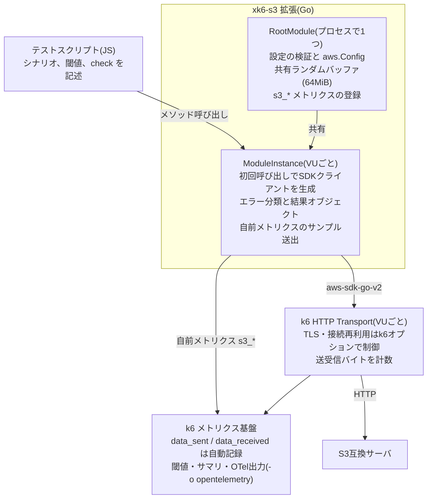

# xk6-s3 設計書

2026-10-09

## 概要と目的

xk6-s3は、aws-sdk-go-v2を薄くラップしたk6のJavaScript拡張で、S3互換ストレージの性能をk6のシナリオ機能で測るためのツールである。オブジェクトのボディはGo側で生成・読み捨てし、jslib-awsのようなJS実装で起きる負荷生成側のCPU・メモリ問題を避ける。

計測値はk6のメトリクス基盤に載せ、閾値判定、終了時サマリ、OpenTelemetry出力(`-o opentelemetry`)をk6の標準機能のまま使う。拡張自身はOTelの送信処理を持たない。

## スコープ

初版(v0.1)は機能リストの【必須】項目に限定する。トレースは伝播も含めて対象外とする。

| 区分 | 初版に含む | 次版以降 |
| --- | --- | --- |
| クライアント | エンドポイント、アドレス方式、送信方式(署名・チェックサム)の選択、タイムアウト、リトライ無効化 | 複数エンドポイント振り分け、チャンク署名方式(`STREAMING-AWS4-HMAC-SHA256-PAYLOAD`)の再現 |
| 操作 | Put / Get / Head / Delete、DeleteObjects、ListObjectsV2、バケット作成・削除、マルチパートアップロード | Range GET、CopyObject、条件付き・バージョニング・タグ |
| データ | サイズ指定と分布、Go側でのボディ生成と読み捨て | 圧縮率指定、読み出し内容の検証 |
| キー・データセット | 実行IDつきプレフィックス、並列プリロード、プレフィックス一括削除 | Zipf分布などのアクセス偏り |
| 計測 | k6組み込み+自前メトリクス、エラー分類、タグ制御 | トレース、パート単位以上の詳細タイミング |
| API・配布 | 同期API、プリセットシナリオ、k6互換性の明記とCI | 非同期API、組み込み済みバイナリ配布 |

## アーキテクチャ

SDKのHTTPクライアントにはVUのk6 Transportを使う。これにより `data_sent` / `data_received` がk6側で自動記録される。単発の操作(Put / Get など)では1つのVUが同時に使う接続は1本なので、VU単位の接続プールで不足しない。

一方、`putObjectMultipart`、`preload`、`deletePrefix` は1つのVUの中でgoroutineにより並列に通信する。k6 Transportのアイドル接続の上限はホストあたり `batchPerHost`(既定6)、全体で `batch`(既定20)なので、これを超える並列度では接続の張り直しが起きる。そこで並列操作では、VUのTransport(`*http.Transport`)を `Clone()` し、`MaxIdleConnsPerHost` と `MaxIdleConns` を指定した並列度に引き上げた専用のTransportを使う。専用のTransportは接続を再利用するためクライアントごとに保持し、より大きな並列度が指定されたときに作り直す。`DialContext` はVUのk6 Dialerのまま引き継がれるため、送受信バイトの計数とTLS設定は維持される。Transportが `*http.Transport` でない場合(k6内部の変更など)は警告を出し、VUのTransportをそのまま使う。

k6 Transportはinitコンテキストでは使えないため、SDKクライアントは各VUの初回呼び出し時に遅延生成する。以前のサンプルシナリオにあった「全VUでクライアントを共有する」案は、この方針で置き換える。VU状態というk6内部APIへの依存は、互換性CIで検知する。

## JS API

モジュールは `k6/x/s3` としてimportする。クライアントはinitコンテキストで `new s3.Client(config)` により生成し、設定の検証のみ行う。SDKクライアントの実体は各VUの初回呼び出し時に作る(アーキテクチャ参照)。

| メソッド | 用途 | 主な引数 |
| --- | --- | --- |
| `createBucket` / `deleteBucket` | バケット操作 | bucket |
| `putObject` | アップロード | bucket, key, size |
| `putObjectMultipart` | マルチパートアップロード。失敗時は自動でAbort | bucket, key, size, { partSize = 5MiB, concurrency = 5 } |
| `getObject` | ダウンロード。ボディはGo側で読み捨て | bucket, key |
| `headObject` / `deleteObject` | メタデータ取得・削除 | bucket, key |
| `deleteObjects` | DeleteObjectsによる一括削除(最大1000件)。キー単位のエラーが1件でもあれば失敗とし、最初のエラーを返す | bucket, keys, { quiet = false } |
| `listObjects` | ListObjectsV2。1リクエストを1回の `list` 操作として計測 | bucket, prefix, { maxKeys, maxPages = 1(0で全件) } |
| `preload` | setup用の並列事前投入。キーは `prefix + 連番`(0から) | bucket, prefix, count, size, { concurrency = 16 } |
| `deletePrefix` | 後片付け用の並列削除。誤操作防止のため空のprefixは不可 | bucket, prefix, { concurrency = 16 } |

`putObjectMultipart` は aws-sdk-go-v2 の upload manager と同じ送り方を再現する。既定のパートサイズ(5MiB)と並列度(5)はupload managerの既定値に合わせる。`checksum: when_supported` ではCreateMultipartUploadとUploadPartにチェックサムアルゴリズム(未指定時はCRC32)を指定し、CompleteMultipartUploadに各パートのチェックサムを含める。`when_required` ではいずれも指定しない。タイムアウトは個々のリクエストに適用し、全体には適用しない。パートの失敗時は残りのパートを打ち切ってAbortする。打ち切られたパートは `canceled` として扱い、メトリクスに記録しない。Abortはテスト終了でVUコンテキストがキャンセルされた後も実行し、未完了のアップロードを残さない。

S3エラー・ネットワークエラーでは例外を投げず、結果オブジェクトを返す。例外を投げるのは引数不正などのスクリプト側の誤りに限る。イテレーションの中断によるエラー率の歪みを避けるためである。

| フィールド | 内容 |
| --- | --- |
| `ok` | 成功したか |
| `status` | HTTPステータス(ネットワークエラー時は0) |
| `bytes` | ボディの送信または受信バイト数 |
| `errorKind` / `errorCode` | エラー分類とS3エラーコード(エラー処理参照) |
| `error` | エラーメッセージ(成功時は空) |
| `requestId` | `x-amz-request-id`。サーバログとの突き合わせ用 |
| `count` | `listObjects` / `deleteObjects` / `preload` / `deletePrefix` で一覧・投入・削除できたオブジェクト数 |
| `failed` | `deleteObjects` / `preload` / `deletePrefix` で失敗したオブジェクト数 |

`preload` / `deletePrefix` の結果は、失敗が1件もなければ `ok` とし、エラー情報には最初の失敗を入れる。

## クライアント設定

既定値は、現行のAWS SDKが送るリクエストをそのまま再現することと、測定値を歪めないことを優先して選ぶ。

| 項目 | 既定値 | 説明 |
| --- | --- | --- |
| `endpoint` | 環境変数 `AWS_ENDPOINT_URL_S3`、なければ `AWS_ENDPOINT_URL` | 接続先URL。AWS SDKと同じ優先順位で環境変数から補う。どちらもなければエラー |
| `region` | 環境変数 `AWS_REGION`、なければ `AWS_DEFAULT_REGION`、なければ `us-east-1` | 署名用リージョン。`us-east-1` 以外は `createBucket` のLocationConstraintにも使う |
| `accessKey` / `secretKey` / `sessionToken` | 環境変数 `AWS_ACCESS_KEY_ID` / `AWS_SECRET_ACCESS_KEY` / `AWS_SESSION_TOKEN` | 静的認証情報 |
| `pathStyle` | `true` | パススタイル/仮想ホストスタイルの切り替え |
| `checksum` | `when_supported` | `when_supported`(SDK既定) / `when_required`。送信方式参照 |
| `checksumAlgorithm` | (未指定) | `CRC32` / `CRC32C` / `CRC64NVME` / `SHA1` / `SHA256`。未指定時はSDK既定(CRC32)。`when_required` とは併用できない |
| `payloadSigning` | `auto` | `auto`(SDK既定) / `unsigned` / `signed`。送信方式参照 |
| `timeout` | `60s` | 1操作あたりのタイムアウト。期間文字列またはミリ秒の数値(k6の慣例に従う) |
| `maxAttempts` | `1` | SDKのリトライ回数。既定でリトライなし |
| `tags` | `[]` | 任意タグの有効化。`bucket` / `size_class`(メトリクス設計参照) |

未知のキーはタイプミスを防ぐためエラーとする。

### 送信方式(署名・チェックサム)

PUTとUploadPartでは、署名とチェックサムの設定によってリクエストの形そのものが変わる。ボディ全体のSHA256で署名するか、`aws-chunked` でボディを送りチェックサムを末尾(trailer)に付けるかで、サーバ側の受信処理と署名検証の処理が異なる。そのためこの設定は、負荷生成側のCPUを節約するための調整ではなく、想定する実クライアントの送信方式を再現するためのものとして扱う。既定値は、現行のaws-sdk-go-v2(および同世代のAWS SDK・AWS CLI)の既定の挙動に合わせる。

aws-sdk-go-v2の既定(`payloadSigning: auto`)で、PutObject / UploadPart は次の形式で送られる(`internal/client` のテストで確認済み)。

| スキーム | `checksum` | `x-amz-content-sha256` | ボディ | チェックサム |
| --- | --- | --- | --- | --- |
| HTTPS | `when_supported` | `STREAMING-UNSIGNED-PAYLOAD-TRAILER` | `aws-chunked` | trailer(`x-amz-checksum-*`) |
| HTTPS | `when_required` | `UNSIGNED-PAYLOAD` | そのまま | なし |
| HTTP | `when_supported` | ボディ全体のSHA256 | そのまま | 送信前に計算してヘッダに付与 |
| HTTP | `when_required` | ボディ全体のSHA256 | そのまま | なし |

`payloadSigning` の `unsigned` / `signed` は、スキームによる切り替えを上書きする。古いSDKや他言語のクライアントの送り方に合わせたい場合に使う。上書き時の形式は次のとおり。

| スキーム | `checksum` | `payloadSigning` | `x-amz-content-sha256` | ボディ | チェックサム |
| --- | --- | --- | --- | --- | --- |
| HTTPS | `when_supported` | `unsigned` | `STREAMING-UNSIGNED-PAYLOAD-TRAILER` | `aws-chunked` | trailer(既定と同じ) |
| HTTPS | `when_supported` | `signed` | ボディ全体のSHA256 | そのまま | 送信前に計算してヘッダに付与 |
| HTTPS | `when_required` | `signed` | ボディ全体のSHA256 | そのまま | なし |
| HTTP | `when_supported` | `unsigned` | `UNSIGNED-PAYLOAD` | そのまま | 送信前に計算してヘッダに付与 |
| HTTP | `when_required` | `unsigned` | `UNSIGNED-PAYLOAD` | そのまま | なし |

上書きはSDKのチェックサム処理より前に置いた独自のミドルウェアで行い、署名に使うペイロードハッシュをコンテキストに設定する。trailerつきのチェックサムはボディ全体のSHA256による署名と組み合わせられないため、`signed` ではチェックサムを拡張側で計算してヘッダに付け、SDKのtrailer処理を抑止する。trailerつきのチェックサムはSDKの制約によりHTTPSでのみ使われる。HTTPでのチャンク署名方式(`STREAMING-AWS4-HMAC-SHA256-PAYLOAD`、Java SDKやminio-goなどが使う)はaws-sdk-go-v2が対応していないため、初版では再現しない。

各組み合わせのヘッダとボディの形式は、リクエストを記録するテストサーバに対するテストで検証し、READMEにも表として載せる。examplesでは想定するクライアントを明記し、それに合わせた設定を書く。

`checksum` はレスポンス側(`ResponseChecksumValidation`)にも適用し、GETのチェックサム検証もSDKの既定の挙動に従う。`aws-chunked` やtrailerつきのチェックサムに対応していないS3互換実装では、既定値のままだとPUTが失敗する。これはその実装の互換性の問題として結果に出すべきもので、拡張側で既定値を変えて隠すことはしない。古いクライアントを想定する場合は `when_required` を指定する。

署名やチェックサムの計算は負荷生成側のCPUを消費し、大きなオブジェクトや高い並列度では負荷生成側がボトルネックになりうる。READMEでは負荷生成ホストのCPU使用率を監視し、飽和していないことを確認するよう案内する。

TLS検証やコネクション再利用はk6のHTTP Transportを使うため、拡張の設定ではなくk6のオプション(`insecureSkipTLSVerify`、`tlsAuth`、`noConnectionReuse` など)で制御する。

## データ生成とキー管理

ボディはプロセス起動時に1回だけ生成する共有ランダムバッファ(64MiB)から切り出す。オブジェクトごとに開始オフセットをずらし、同一内容になるのを避ける。PUTのボディは、バッファの終端に達したら先頭に戻って読み続ける循環リーダとし、64MiBを超えるオブジェクトにも対応する。署名やチェックサムの計算で巻き戻しが必要になるため、循環リーダは `io.ReadSeeker` を実装し、オフセットとサイズだけを持つ。バッファは生成後に読み取り専用とするため、VUやgoroutineの間で安全に共有できる。GETのボディは `io.Discard` へ読み捨て、バイト数だけ数える。

サイズ引数は次の形式を受け付ける。

- 数値(バイト)または単位付き文字列(`"1MiB"`、`"512KiB"`、`"1.5MiB"`、`"10MB"`)。`KiB` などは1024の累乗、`KB` などは1000の累乗とし、大文字小文字は区別しない
- 一様分布 `{ dist: "uniform", min, max }`
- 対数正規分布 `{ dist: "lognormal", median, sigma }`。`sigma` は元の正規分布の標準偏差。サンプルはS3のオブジェクトサイズの上限(5TiB)で打ち切る
- 重み付き選択 `{ dist: "choice", values: [{ size, weight }] }`

キーの命名はスクリプトに任せ、拡張は実行IDを返す `s3.runId()` を提供する。キーの組み立てにinitコンテキストでも使えるよう、実行IDはVU状態(VUのタグ)には依存させず、RootModuleの生成時に1回だけ決める。値は環境変数 `XK6_S3_RUN_ID` があればその値、なければ短いランダム文字列とし、プロセス内の全VUで共通とする。複数のk6プロセスで実行IDをそろえたい場合や、メトリクスと突き合わせたい場合は、`XK6_S3_RUN_ID` と `--tag test-id=` に同じ値を渡す運用とする。キーは `<runId>/<データセット名>/<連番>` の形を推奨し、`deletePrefix` で実行単位に後片付けできるようにする。

`preload` と `deletePrefix` は拡張内でgoroutineにより並列実行する。setup中の操作もメトリクスに記録されるため、閾値は `scenario` タグで絞る運用とし、サンプルシナリオでもそう書く。

## メトリクス設計

k6組み込みメトリクスと自前メトリクスを併用する。SDKのHTTPクライアントにVUのk6 Transportを使わせることで、`data_sent` / `data_received` はk6が自動で記録する。`iterations`、`iteration_duration`、`checks` もそのまま使う。`http_req_*` 系は `k6/http` 専用のため記録されず、代わりに以下の自前メトリクスを送る。

`data_sent` / `data_received` は、k6のDialerが数えたバイト数をイテレーションの終了時にまとめて送出したものである。大きなマルチパートアップロードのような長いイテレーションでは、時系列上で値がイテレーション終了の時点に偏る。setup中の `preload` の分も、setupの終了時にまとめて記録される。時系列でスループットを見る場合は、操作ごとに送出する `s3_op_bytes` を使う。

| メトリクス | 型 | タグ | 内容 |
| --- | --- | --- | --- |
| `s3_op_duration` | Trend | op | 操作の全体時間(ボディ転送を含む) |
| `s3_op_ttfb` | Trend | op | GETのみ。レスポンスヘッダ受信まで |
| `s3_op_bytes` | Counter | op | ボディの送信(PUT)または受信(GET)バイト数。成功した操作のみ |
| `s3_op_errors` | Rate | op | 操作の失敗率。閾値判定用 |
| `s3_errors` | Counter | op, error\_kind, error\_code, status | エラーの内訳 |

`op` の値は `put`、`get`、`head`、`delete`、`delete_objects`、`list`、`create_bucket`、`delete_bucket`、`put_multipart`(全体)、`upload_part`(パート単位)とする。

タグは3段階で管理する。

- 常に付与: `op`、およびVUから引き継ぐタグ(`scenario`、`group`、`--tag` で指定したユーザタグ)
- 設定で有効化: `bucket`、`size_class`(`<4KiB`、`<64KiB`、`<1MiB`、`<16MiB`、`<128MiB`、`>=128MiB` の6区分)
- 付与しない: キー名、リクエストID(カーディナリティ爆発の防止)

OTel出力ではTrendがHistogramに変換される。k6はバケット境界を指定しないため、OTel SDKの既定の境界(0, 5, 10, 25, … 10000 ms)になり、低レイテンシの操作では分解能が足りない(ローカルのversitygwではHEADがすべて0〜5msのバケットに入った)。OTel標準の環境変数 `OTEL_EXPORTER_OTLP_METRICS_DEFAULT_HISTOGRAM_AGGREGATION=base2_exponential_bucket_histogram` で指数ヒストグラムに切り替えられることを確認したため、バックエンドが対応していればこれを推奨し、READMEに記載する。RateはOTel出力ではカウンタ(`s3_op_errors.total` など)に変換される。

## エラー処理

SDKが返すエラーを次の `error_kind` に分類し、結果オブジェクトと `s3_errors` のタグに載せる。SDKのリトライは既定で無効なので、1回の失敗はそのまま1件のエラーとして記録される。

| error\_kind | 判定 | error\_code |
| --- | --- | --- |
| `s3` | S3のエラーレスポンス(APIエラー)を解析できた | `SlowDown`、`NoSuchKey` などのS3エラーコード |
| `http` | HTTPエラーだがS3エラーコードを解析できない(ボディのないHEADの404などを含む) | 空 |
| `timeout` | 操作タイムアウト、ネットワークタイムアウト | 空 |
| `network` | 接続拒否・リセット、DNS、TLSの失敗 | 空 |
| `canceled` | テスト終了によるVUコンテキストのキャンセル | 空 |
| `other` | 上記のいずれにも当たらない(SDK内部のエラーなど) | 空 |

SDKはエラーボディを解析できないとき、HTTPステータスの文言からエラーコードを合成する(`NotFound`、`BadGateway` など)。合成されたコードと一致するものは `http` に分類する。このため、ステータス文言と同名のS3エラーコード(`ServiceUnavailable`、`NotImplemented` など)を実際に返された場合も `http` に分類されるが、`status` タグで区別できる。

`canceled` はテスト終了時の打ち切りで発生するため、計測値として扱わない。`s3_op_duration`、`s3_op_ttfb`、`s3_op_bytes`、`s3_op_errors`、`s3_errors` のいずれのサンプルも送出せず、結果オブジェクトで `errorKind: "canceled"` を返すだけとする。途中で打ち切られた操作の所要時間やバイト数が分布に混ざるのを避けるためである。エラー時は `requestId` を付けて警告ログを出すが、ログが負荷要因にならないよう操作種別ごとに先頭の数件に限る。

## 同梱物・配布・互換性

ソースのみをOSSとして公開し、利用者が `xk6 build --with` で組み込む形で配布する。

- **リポジトリ構成**: ルートパッケージ(拡張の登録)、`internal/client`(SDKクライアントとエラー分類)、`internal/data`(バッファとサイズ分布)、`internal/metrics`(メトリクス定義とタグ)、`examples/`
- **プリセットシナリオ**: `examples/` にput、get、mixed、multipart、stat、list、deleteの7本と、Warpでは表現できない例として背景アップロード中の読み込みレイテンシを閾値で判定するslo.jsを置く。前の7本はWarpの `put`、`get`、`mixed`、`multipart-put`、`stat`、`list`、`delete` に相当する負荷を再現し(deleteはWarpと同じくDeleteObjectsで100件ずつ削除する)、既定値もWarpに合わせる(mixedの比率はGET:HEAD:PUT:DELETE=45:30:15:10)。接続先や規模は環境変数で指定する
- **E2Eテスト**: `e2e/formats.js` で全送信方式(スキーム × `checksum` × `checksumAlgorithm` × `payloadSigning`)のPUTとマルチパートを実サーバに対して検証する。`make e2e`(`e2e/run.sh`)がversitygw(posixバックエンド)をHTTPとHTTPSで起動し、E2Eテストとexamplesを短時間実行する
- **README**: Go環境でのビルドとxk6 Dockerイメージでのビルド手順、動作確認済みのk6バージョン、確認済みのS3互換実装
- **対応k6バージョン**: k6 v2系のみ(モジュールパス `go.k6.io/k6/v2`)。v1系はモジュールパスが異なるため対応しない
- **CI**: 対応k6バージョンでのビルド確認をpushごとと週次で実行し、versitygw(posixバックエンド)のコンテナに対してexamplesを短時間実行する統合テストを行う
- **バージョニング**: APIが固まるまではv0.xとする
- **ライセンス**: ソースはApache-2.0。拡張を組み込んだバイナリはk6本体のAGPLv3の条件に従う旨をREADMEに明記する

